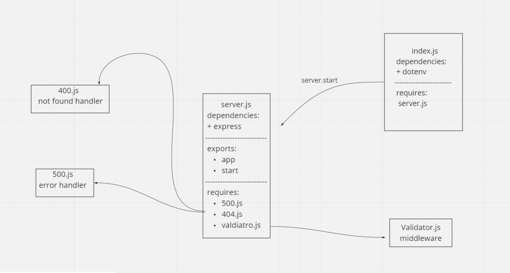

# basic-express-server
## heroku app link:  
[https://saeed-basic-express-server.herokuapp.com/](https://saeed-basic-express-server.herokuapp.com/)  
## pull request link:  
[https://github.com/awwadsaeed/basic-express-server/pull/1](https://github.com/awwadsaeed/basic-express-server/pull/1)  
## GitHub actions link:  
[https://github.com/awwadsaeed/basic-express-server/actions](https://github.com/awwadsaeed/basic-express-server/actions)
## describtion  
a basic express server that has a get request an tests that requst along with some middleware.
it integrated CI testing and Unit testing.  
## UML:  

